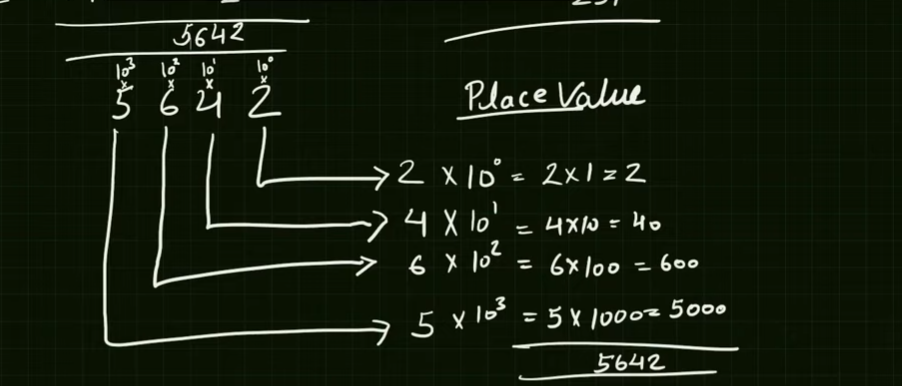

# Day 4A : Understanding decimal number system

0-9 : these are digits

4.5 or 45 : these are decimal numbers

01 : this is binary number system

0 7 : octacl numbers

0 15 : this is hexadecimal number system

- How to create numbers using digits

sara data 0s and 1s me store hota hai

### Decimal Number system

Roman Number system : I II III IV V

````md
converting 2465 to 5642

my sol

```js
const digitList = [2, 4, 6, 5];
let num = 1;
let sum = 0;
let mul = 1000;
let size = digitList.length;

let newAr = [];

// reversing the array

let start = 0;
let temp = 0;
let last = size - 1;

while (start <= last) {
  temp = digitList[start];
  digitList[start] = digitList[last];
  digitList[last] = temp;
  start++;
  last--;
}

console.log(digitList);
for (let i = 0; i < digitList.length; i++) {
  num = digitList[i] * mul;
  sum += num;
  mul = mul / 10;
}

console.log(sum);
```
````

- vid sol

```js
const digitlist = [2, 4, 6, 5];

const sum = 2 * 1 + 4 * 10 + 6 * 100 + 5 * 1000;
console.log(sum);
```



```js
// creating a function to generate a number using digit

let digit = [2, 4, 6, 5];
let mul = 0;
let num = 1;

let digitsToNumber = (digit) => {
  for (let i = 0; i < digit.length; i++) {
    num = digit[i] * Math.pow(10, i);
    mul += num;
  }

  return mul;
};

let a = digitsToNumber(digit);

console.log(a);
```
